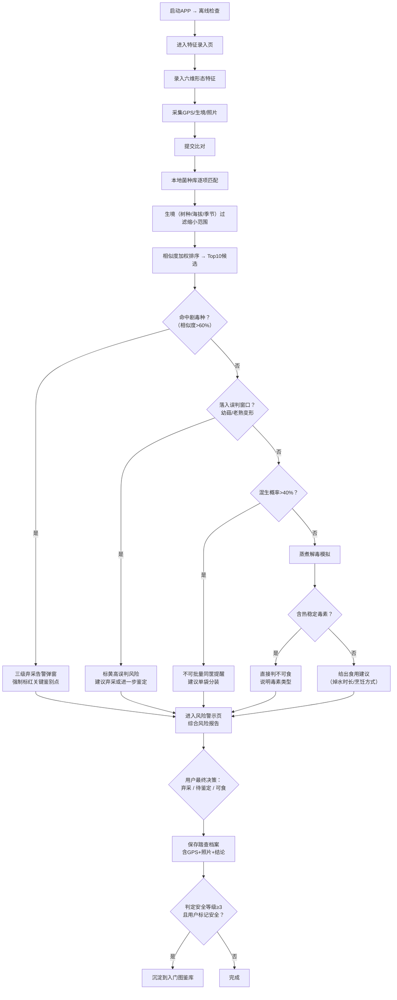

## 1. 产品概述
面向野外采菌爱好者与科普向导的菌菇辨识采集生产力系统，通过形态特征逐项比对、中毒风险多维度研判、踏查档案沉淀，解决野外采菌"凭经验误判、剧毒种难辨、混采风险高"的核心痛点，大幅降低误食中毒概率。

- 核心价值：**生命安全**优先——剧毒种弃采告警机制宁可错杀不可放过
- 目标用户：采菌爱好者（入门/资深）、野外科普向导、菌物踏查人员
- 差异化：本地离线菌种库 + 多维度风险研判引擎 + 强制标红关键鉴别点

---

## 2. 核心功能

### 2.1 用户角色
| 角色 | 核心权限 |
|------|----------|
| 采菌爱好者 | 特征录入、比对研判、查看入门图鉴、管理个人踏查档案 |
| 科普向导 | 所有用户权限、归档踏查数据、沉淀入门图鉴条目 |

### 2.2 功能模块
1. **特征录入页**：菌盖/菌褶/菌柄/菌环/菌托/孢印颜色六维形态录入 + 生境/海拔/季节/GPS/照片元数据
2. **比对研判页**：本地菌种库逐项特征匹配、相似度加权排序、候选种列表
3. **风险警示页**：剧毒鹅膏易混点标红、混生概率计算、误判窗口校验、蒸煮解毒模拟、弃采告警
4. **踏查档案页**：采集记录时间线、GPS轨迹、生境照片、鉴定结论归档、历史查询
5. **入门图鉴页**：确认安全的常见种沉淀、图文卡片、关键鉴别要点速查

### 2.3 页面详情
| 页面名称 | 模块名称 | 功能描述 |
|----------|----------|----------|
| 特征录入页 | 六维形态采集 | 菌盖（形状/颜色/直径/鳞片）、菌褶（颜色/密度/附着方式）、菌柄（颜色/长度/粗度/质地）、菌环（有无/位置/形态）、菌托（有无/形态/颜色）、孢印颜色 |
| 特征录入页 | 生境元数据 | GPS坐标、树种、海拔、采集日期/季节、生境照片（多张）、备注 |
| 比对研判页 | 特征匹配引擎 | 六维形态逐项比对、加权相似度算法、生境过滤、候选种Top10排序 |
| 比对研判页 | 匹配详情 | 每个候选种的特征命中数/差异数、关键差异点高亮、相似种对照 |
| 风险警示页 | 剧毒鉴别 | 鹅膏属特征（白色菌褶+菌托+菌环三连）强制标红、与可食易混种（鸡枞/松茸/草菇等）关键区别点 |
| 风险警示页 | 混生风险 | 同一GPS±50m范围内近30天相似种混生概率、不可批量同筐提醒 |
| 风险警示页 | 误判窗口 | 幼菇期（菌盖未展开）、老熟变形（菌褶液化/褪色）自动检测并标黄警告 |
| 风险警示页 | 毒素模拟 | 鹅膏毒肽/鬼笔毒肽/鹿花菌素/毒蝇碱等热稳定性毒素检测→直接判不可食 |
| 风险警示页 | 弃采告警 | 剧毒疑似种（相似度>60%且有毒等级≥3）触发三级弹窗告警，需二次确认 |
| 踏查档案页 | 时间线 | 按日期倒序展示采集记录、生境缩略图、鉴定结论标签 |
| 踏查档案页 | 详情查看 | 单条记录完整信息、特征参数、比对过程、风险评估、最终结论 |
| 踏查档案页 | 导出分享 | 单条/批量导出踏查报告JSON、照片打包 |
| 入门图鉴页 | 图鉴卡片 | 安全等级✅的常见种、中文名/拉丁名/俗名、特征图、生境、食用方法 |
| 入门图鉴页 | 速查筛选 | 按生境/季节/可食等级筛选、关键词搜索 |
| 入门图鉴页 | 鉴别要点 | 每种突出3-5个肉眼可辨的关键特征、与易混有毒种的区别 |

---

## 3. 核心流程

**主采集研判流程：**

---

## 4. 用户界面设计

### 4.1 设计风格
- **主色调**：森林深绿 `#1a4d2e` + 菌菇米白 `#f5f0e6` + 警示血红 `#c81e1e`
- **辅色调**：针叶棕 `#8b5a2b`、苔藓黄 `#c4a35a`、安全绿 `#2d8a4e`、警告橙 `#e8a33d`
- **视觉主题**：原始森林/有机自然风——木纹纹理、菌褶图案、孢子纹理点缀
- **按钮风格**：圆润胶囊型（圆角16px），三级深度阴影，按压下沉效果
- **字体**：标题用 **Noto Serif SC**（衬线，古典学术感），正文用 **Noto Sans SC**（清晰可读）
- **布局风格**：移动优先卡片式，顶部导航条 + 底部标签栏，卡片悬浮微弹动效
- **图标风格**：Lucide 线性图标 + 自定义菌菇 emoji 组合

### 4.2 页面设计概览
| 页面名称 | 模块名称 | UI 元素 |
|----------|----------|---------|
| 特征录入页 | 六维采集区 | 手风琴折叠卡片，每项含颜色选择器（色板+文字描述）、尺寸滑块、多选项；渐变展开动画 |
| 特征录入页 | 生境元数据 | GPS定位按钮（带脉冲动画）、海拔输入、树种下拉（多选tag）、照片上传区（网格+点击放大） |
| 比对研判页 | 候选种列表 | 纵向瀑布流卡片，每张卡：缩略图 + 中/拉/俗名 + 相似度进度条 + 安全等级色标；匹配项✅差异项❌ |
| 比对研判页 | 匹配详情抽屉 | 从底部弹出，左右对照：左录入特征 / 右菌种特征，差异处闪烁高亮 |
| 风险警示页 | 风险仪表盘 | 环形进度图：剧毒风险（红）/误判风险（黄）/混生风险（橙）/解毒概率（绿），数值中心显示 |
| 风险警示页 | 关键鉴别点 | 顶部红色横幅"⚠️ 剧毒鹅膏三连征：白菌褶 + 菌环 + 菌托"，每点红框闪烁，配对比图 |
| 风险警示页 | 弃采告警弹窗 | 三级模态窗：第1级全屏红色抖动+警报音提示；第2级勾选"我已阅读不可食说明"；第3级二次确认弃采 |
| 踏查档案页 | 时间线 | 左侧垂直时间轴（圆点+连线），右侧采集卡片，悬停时间轴高亮连线 |
| 入门图鉴页 | 图鉴网格 | 3列响应式网格（移动端1列），卡片翻转效果：正面图/背面鉴别要点；右下角安全等级徽章 |

### 4.3 响应式设计
- **移动优先**：以 375px-428px 宽度为主设计断点，确保单手操作可达区（底部1/3）放置核心操作按钮
- **平板适配**：768px+ 双列布局，图鉴切换 2-3 列
- **桌面适配**：1024px+ 左侧导航 + 右侧内容区，图鉴 4-5 列
- **触控优化**：按钮最小高度 48px，卡片间距 ≥ 12px，支持左滑删除档案
- **离线态**：首次加载缓存菌种库至 IndexedDB，网络断开时顶部显示"🟢 离线模式·本地库 v1.0"

---
