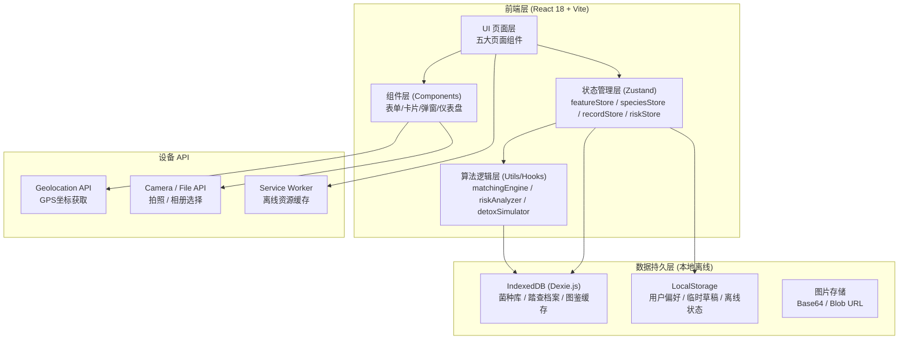
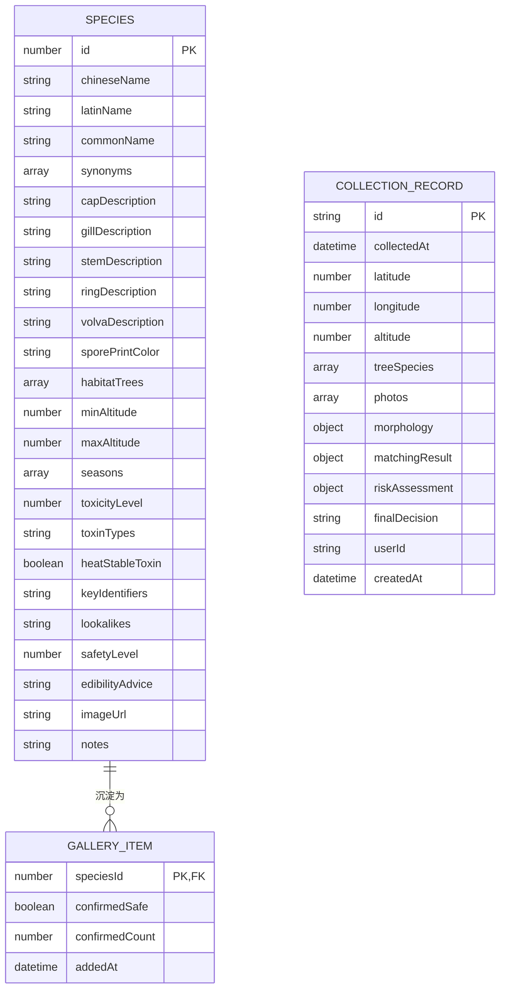

## 1. 架构设计


## 2. 技术选型
- **前端框架**：React 18 + TypeScript 5.4
- **构建工具**：Vite 5.2
- **样式方案**：Tailwind CSS 3.4 + 自定义 CSS 变量（主题色/动画）
- **状态管理**：Zustand 4.5（轻量、无 boilerplate、支持 devtools + persist）
- **路由**：React Router DOM 6.22（HashRouter 支持离线）
- **本地数据库**：Dexie.js 4.0（IndexedDB 封装，菌种库/档案存储）
- **图标**：Lucide React 0.371
- **离线方案**：Service Worker（vite-plugin-pwa）+ 资源预缓存
- **无需后端**：纯前端离线应用，菌种库内置 mock 数据，档案本地存储

## 3. 路由定义
| 路由路径 | 页面组件 | 说明 |
|----------|----------|------|
| `/` | `FeatureInput` | 特征录入页（首页，采菌第一入口） |
| `/match` | `MatchingAnalysis` | 比对研判页（需携带录入特征参数跳转） |
| `/risk` | `RiskWarning` | 风险警示页（综合风险报告 + 三级告警） |
| `/archive` | `SurveyArchive` | 踏查档案页（时间线 + 详情） |
| `/gallery` | `BeginnerGallery` | 入门图鉴页（安全种速查） |
| `/archive/:id` | `ArchiveDetail` | 单条档案详情（嵌套路由） |

## 4. 数据模型

### 4.1 ER 图


### 4.2 核心类型定义（TypeScript）

```typescript
// 六维形态特征
interface MorphologyFeatures {
  cap: { shape: string; color: string; diameter: number; hasScales: boolean; scaleColor?: string };
  gill: { color: string; density: 'crowded' | 'close' | 'distant'; attachment: string };
  stem: { color: string; length: number; thickness: number; texture: string; hasVolva: boolean; volvaShape?: string; volvaColor?: string };
  ring: { present: boolean; position?: 'upper' | 'middle' | 'lower'; shape?: string; color?: string };
  sporePrint: string;
  developmentStage: 'young' | 'mature' | 'old'; // 用于误判窗口检测
  deformed: boolean;
}

// 菌种库条目
interface Species {
  id: number;
  chineseName: string; latinName: string; commonName: string;
  cap: { shapes: string[]; colors: string[]; diameterRange: [number, number]; scales: boolean };
  gill: { colors: string[]; densities: string[]; attachments: string[] };
  stem: { colors: string[]; lengthRange: [number, number]; thicknessRange: [number, number]; textures: string[] };
  ring: { present: boolean; positions: string[]; shapes: string[]; colors: string[] };
  volva: { present: boolean; shapes: string[]; colors: string[] };
  sporePrintColors: string[];
  habitat: { trees: string[]; altitudeRange: [number, number]; seasons: string[] };
  toxicity: { level: 0|1|2|3|4; types: string[]; heatStable: boolean };
  safetyLevel: 1|2|3|4|5; // 5最安全
  keyIdentifiers: string[];
  lookalikeDangers: { speciesId: number; difference: string }[];
  edibility: { edible: boolean; advice: string; blanchMinutes?: number };
  imageUrl: string;
}

// 踏查档案
interface CollectionRecord {
  id: string;
  collectedAt: string;
  gps: { lat: number; lng: number; accuracy: number };
  altitude: number;
  trees: string[];
  season: string;
  photos: string[]; // Base64 或 BlobURL
  morphology: MorphologyFeatures;
  matching: { candidates: MatchCandidate[]; topMatch?: number };
  risk: RiskAssessment;
  finalDecision: 'discarded' | 'pending' | 'edible';
  notes: string;
}

interface MatchCandidate {
  speciesId: number;
  matchScore: number; // 0-100
  matchedFeatures: string[];
  differingFeatures: { feature: string; input: string; expected: string }[];
}

interface RiskAssessment {
  amanitaMatch: boolean;
  toxicityRisk: number; // 0-100
  misjudgmentWindow: boolean;
  misjudgmentReason?: string;
  cooccurrenceProb: number; // 0-100
  cooccurringSpecies: number[];
  detoxPossible: boolean;
  detoxFailureReason?: string;
  overallRisk: 'low' | 'medium' | 'high' | 'extreme';
}
```

## 5. 核心算法说明

### 5.1 特征匹配引擎（matchingEngine.ts）
**加权相似度算法**：
- 菌盖权重：15% | 菌褶权重：20% | 菌柄权重：15%
- 菌环权重：20%（鹅膏属关键征） | 菌托权重：20%（鹅膏属关键征） | 孢印权重：10%
- 颜色匹配：计算语义距离（白色/乳白色/近白视为同一族）
- 尺寸匹配：高斯分布函数，落入±30%区间得满分，边缘衰减
- 生境过滤：树种/海拔/季节不匹配的候选种扣20-40分

### 5.2 风险研判引擎（riskAnalyzer.ts）
**四级风险矩阵**：
| 条件 | 等级 | 处置 |
|------|------|------|
| 鹅膏三连征命中2项以上 + 相似度>60% | EXTREME | 强制弃采，三级告警 |
| 毒性等级≥3 + 相似度>50% | HIGH | 强烈建议弃采 |
| 落入误判窗口（幼菇/老熟变形） | MEDIUM | 建议弃采或显微鉴定 |
| 混生概率>40% | MEDIUM | 单袋分装，不可混筐 |
| 其他 | LOW | 按常规烹饪建议 |

### 5.3 蒸煮解毒模拟（detoxSimulator.ts）
内置毒素热稳定性表：
| 毒素类型 | 热稳定 | 解毒建议 |
|----------|--------|----------|
| 鹅膏毒肽（α-amanitin） | ✅ 极稳定 | ❌ 不可食 |
| 鬼笔毒肽 | ✅ 稳定 | ❌ 不可食 |
| 鹿花菌素（Gyromitrin） | ⚠️ 部分分解 | 长时间煮沸+通风仍有风险 |
| 毒蝇碱 | ❌ 大部分降解 | 焯水15分钟以上 |
| 毒肽类（非鹅膏） | ⚠️ 部分 | 建议弃采 |

---
